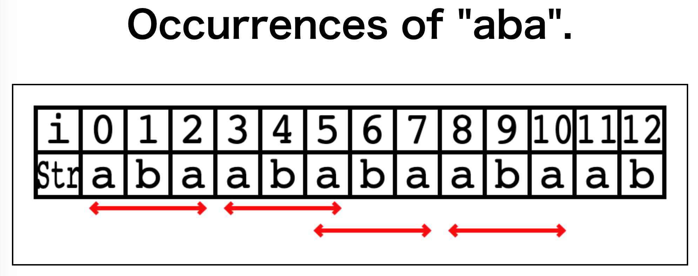

# VisStr

VisStr is a library to visualize a string and its several propeties, such as repetitions, and redundancies.

See [the demo page](https://kg86.github.io/visstr/dist/vis_str.html).

Documentation is [here](https://kg86.github.io/visstr/docs/index.html)

## Usage

Put a canvas in your html.
Import `vis_str.js` like the following.
```html
<canvas id="canvas" style="border:1px solid #000000;"> </canvas>
<script type="text/javascript" src="./vis_str.js"></script>
```

Create an visstr object in your js.
```js
const visstr = window.visstr

const canvas = document.querySelector('#canvas')
// input string
const s = 'abaababaabaab'
// create visstr object.
const vstr = new visstr.VisStr(canvas, s)
```

Create an range list you want to draw, and add line style and color, and then groups them so that ehy are not overlap with each others.
```js
// create occurrences of aba.
const occ_aba = [[0, 2], [3, 5], [5, 7], [8, 10]]
// add line style and color.
const ranges = vstr.makeRanges(occ_aba, 'arrow', '#ff0000')
// make group so that they are not overlap with each others.
const range_groups = vstr.nonOverlapRangeIdxs(ranges)
```

Draw the range list by `vstr.draw`.
```js
// draw the occurrences.
vstr.draw(s, range_groups)
```

The canvas draws the range list as following.



See [the demo](https://kg86.github.io/visstr/dist/vis_str_demo_occ.html).